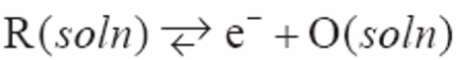
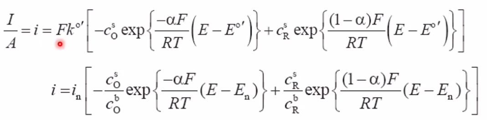

# Faradays law
- The amount (moles) of any substance produces or consumed in an electrode reaction is proportional to the quantity of charge passed.
- Non-faradaic currents:
	- Capacitive currents
	- Electronic conduction
	- Competing reactions

## Coulometry
- Analysis of concentration c$_i$ of a reactant species $i$ in a finite volume V at fixed well-selected voltage
- The total charge converted is Q = -nFVc$_i$/$\nu_i$
	- n av $\nu_i$ are te number of electrons and molecules, respectively, involved in the reaction
- Charge Q is current $I$ integrated over time t: ![[./static/Pasted image 20210216123554.png]]
- Flowing coloumetry
	- Limiting current at given flow and fixed voltage.

# Butler-Volmer equation
Example:
- 
- Butler-Volmer: 
	- $k^\circ$ is a formal rate constant
	- Positive term says 
